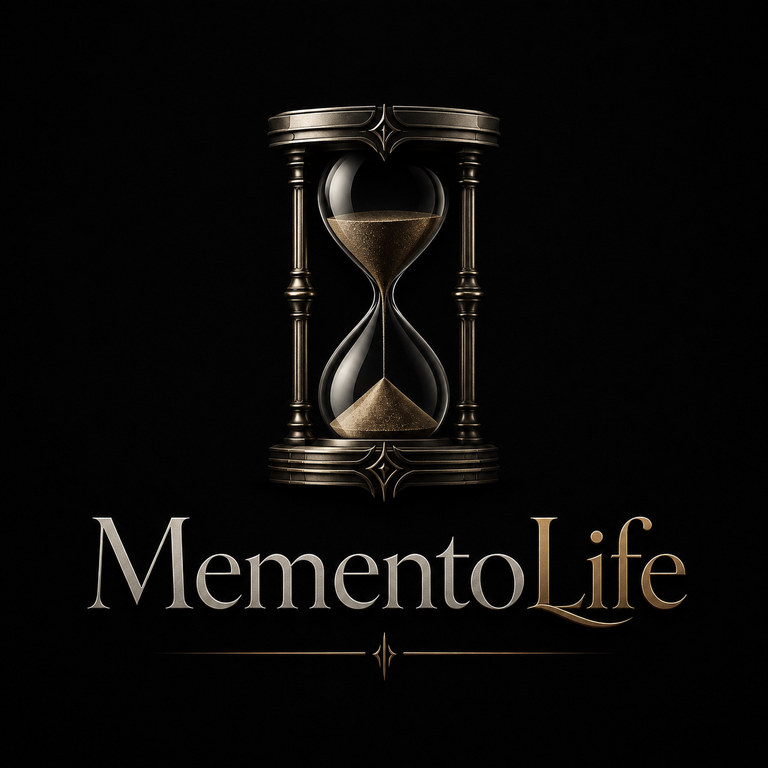

[Español](README.md) | [English](README.en.md)

<p align="center">
  
</p>

# MementoLife — Extensión de Chrome

[](https://chromewebstore.google.com/detail/mementolife/eackmngdibobdeciapcedkmjoecaiblp)

Reemplaza la pestaña nueva por una grilla de semanas, calculada a partir de la fecha de
nacimiento: las semanas vividas se dibujan llenas, las que faltan apenas insinuadas, y un
anillo marca la semana actual. Con tema claro y oscuro, interfaz completa en 6 idiomas, y
una efeméride histórica distinta para todos los días del año.

---

## 📸 Capturas

| | |
|---|---|
|  |  |
|  |  |

---

## 🎯 Funcionalidades

- Grilla de semanas vividas y por vivir, con esperanza de vida ajustable entre 20 y 100 años
- Tema claro, oscuro o el del sistema
- 6 idiomas en toda la interfaz, no sólo en el contenido: español, inglés, francés,
  portugués, italiano y alemán
- Efeméride histórica diaria (366 fechas, en los 6 idiomas), activable o no
- Cero conexiones de red, un solo permiso (`storage`) y la fecha de nacimiento guardada en
  `chrome.storage.local`, nunca en `sync`: no viaja por tu cuenta de Google

Detalle completo en [PRIVACY.md](PRIVACY.md).

---

## 🛠️ Stack Tecnológico

| Capa | Tecnología |
|------|------------|
| **Lenguaje** | TypeScript estricto, sin `any` |
| **Runtime** | Sin framework, sin bundler — ESM nativo, `tsc` como único paso de build |
| **Render** | SVG generado por un core puro: sin DOM, sin `chrome.*`, la fecha entra como parámetro |
| **Testing** | Vitest (unit + snapshots) + Playwright (e2e sobre el paquete real) |
| **Empaquetado** | Manifest V3, un solo permiso, sin service worker |
| **CI** | GitHub Actions en cada push |

La grilla son 4160 puntos, pero el DOM tiene **7 nodos**: se acumulan tres `<path>` —pasado,
futuro y anillo— en vez de emitir un elemento por celda. Medido contra la alternativa
ingenua: 1,30 ms contra 10,00 ms.

---

## Instalar

[](https://chromewebstore.google.com/detail/mementolife/eackmngdibobdeciapcedkmjoecaiblp)

Instalá **MementoLife** directamente desde la **[Chrome Web Store](https://chromewebstore.google.com/detail/mementolife/eackmngdibobdeciapcedkmjoecaiblp)**.

> En ventanas de incógnito, Chrome no permite que ninguna extensión reemplace la pestaña
> nueva. Es una restricción de la plataforma.

## Desarrollo

```bash
npm run typecheck   # tsc estricto, sin any
npm test            # unitarios + snapshots
npm run e2e         # Playwright sobre el paquete construido
npm run build       # paquete instalable en build/
```

---

## Historia del proyecto

MementoLife empezó como una app Android que ponía la grilla en la pantalla de bloqueo.
Funcionaba, pero MIUI y One UI ignoran en silencio los intentos de actualizar sólo la
pantalla de bloqueo (`setBitmap(..., FLAG_LOCK)` no falla: no hace nada). En vez de romper
una decisión de diseño del proyecto, se cambió de plataforma.

---

## 👤 Autor

**Iván Gómez Dell'Osa**

- Email: [ivangomezdellosa@gmail.com](mailto:ivangomezdellosa@gmail.com)
- LinkedIn: [linkedin.com/in/ivangomezdellosa](https://www.linkedin.com/in/ivangomezdellosa/)
- GitHub: [IvanGomezDellOsa](https://github.com/IvanGomezDellOsa)
