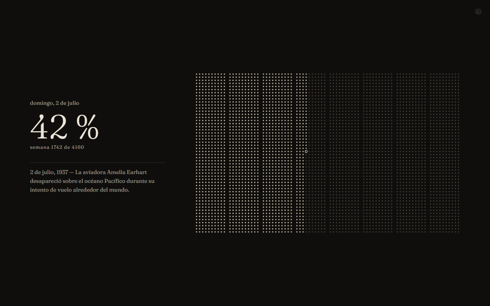
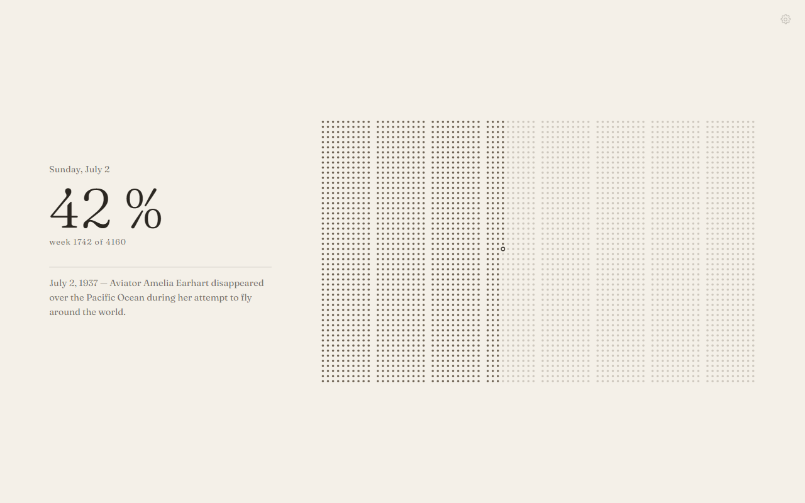
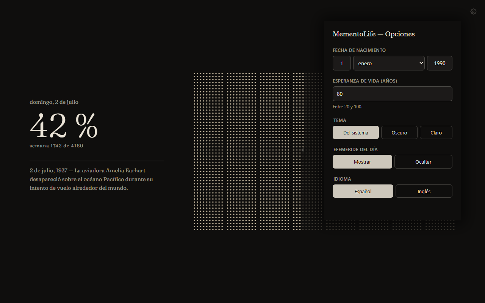
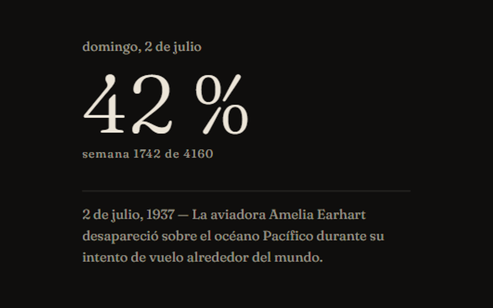

[Español](README.md) | [English](README.en.md)

<p align="center">
  
</p>

# MementoLife — Calendario de vida para la pestaña nueva de Chrome

Extensión de Chrome que reemplaza la pestaña nueva por tu vida entera dibujada como una
grilla de semanas: las que ya viviste, llenas; las que faltan, apenas insinuadas. Un anillo
vacío marca la semana en la que estás ahora. Sin frases motivacionales, sin recordatorios,
sin nada que hacer — sólo la forma de tu vida, cada vez que abrís una pestaña.

---

## 📸 Capturas

| | |
|---|---|
|  |  |
|  |  |

---

## 🛠️ Stack Tecnológico

| Capa | Tecnología |
|------|------------|
| **Lenguaje** | TypeScript estricto, sin `any` |
| **Runtime** | Sin framework, sin bundler — ESM nativo, `tsc` como único paso de build |
| **Render** | SVG generado por un core puro (sin DOM, sin `chrome.*`, sin leer el reloj) |
| **Testing** | Vitest (unit + snapshots) + Playwright (e2e sobre el paquete real) |
| **Empaquetado** | Manifest V3, un solo permiso (`storage`), sin service worker |
| **CI** | GitHub Actions — typecheck, tests, e2e y verificación de cobertura de fuente en cada push |

---

## 🎯 Funcionalidades

**Visualización**
- Grilla de semanas vividas y por vivir, calculada a partir de la fecha de nacimiento
- Esperanza de vida ajustable entre 20 y 100 años
- Anillo vacío como marcador de la semana actual

**Personalización**
- Tema claro, oscuro, o el del sistema
- Español e inglés en toda la interfaz, no sólo en el contenido
- Efeméride histórica diaria (366 fechas, bilingüe), activable o no

**Privacidad**
- Cero conexiones de red — verificado con un test automatizado que falla si aparece cualquier petición
- Un solo permiso: `storage`. Sin `host_permissions`, sin service worker, sin content scripts
- La fecha de nacimiento se guarda con `chrome.storage.local` y nunca con `chrome.storage.sync`, así no viaja a través de tu cuenta de Google

Detalle completo en [PRIVACY.md](PRIVACY.md).

---

## 🏗️ Arquitectura

```
extension/src/core/     lógica pura: sin DOM, sin chrome.*, sin leer el reloj
extension/src/          las páginas: newtab, opciones, preferencias
render-core/            design-tokens.json — única fuente de verdad de diseño
content/efemerides/     las 366 efemérides, en español e inglés
```

El core es puro a propósito: la fecha entra siempre como parámetro. Eso es lo que permite
que los tests sean deterministas y que el gate de regresión visual sea texto (snapshots),
no píxeles.

La grilla son 4160 puntos, pero el DOM tiene **7 nodos**: se acumulan tres `<path>` —pasado,
futuro y anillo— en vez de emitir un elemento por celda. Medido contra la alternativa
ingenua: 1,30 ms contra 10,00 ms, 594 veces menos nodos.

---

## Instalar

```bash
cd extension && npm ci && npm run build
```

Después, en `chrome://extensions`: activar **Modo de desarrollador** → **Cargar
descomprimida** → elegir `extension/build`.

> En ventanas de incógnito, Chrome no permite que ninguna extensión reemplace la pestaña
> nueva. Es una restricción de la plataforma, documentada y no sorteada.

## Desarrollo

```bash
npm run typecheck   # tsc estricto, sin any
npm test            # unitarios + snapshots
npm run e2e         # Playwright sobre el paquete construido
npm run build       # paquete instalable en build/
```

---

## Historia del proyecto

MementoLife empezó como una app Android que ponía la grilla en la pantalla de bloqueo. Se
completó y funcionaba, pero se topó con una limitación de plataforma insalvable: MIUI y
One UI ignoran en silencio los intentos de actualizar sólo la pantalla de bloqueo
(`WallpaperManager.setBitmap(..., FLAG_LOCK)` no falla, simplemente no hace nada). En vez de
romper una decisión de diseño del proyecto, se cambió de plataforma. El código Android queda
congelado en el tag `android-v1-final`.

---

## 📝 Notas de Desarrollo

Desarrollo asistido por LLMs para la implementación del renderer, los tests y la
infraestructura de build. Las decisiones que definen el producto —el pivot de plataforma de
Android a extensión de Chrome, la composición visual final, la paleta de colores, la
geometría de la grilla dirigida por celda para evitar el efecto de vibración óptica, el
modelo de privacidad cero-red y cada iteración de diseño validada a ojo contra capturas
reales— fueron tomadas y dirigidas por mí.

---

## 👤 Autor

**Iván Gómez Dell'Osa**

- Email: [ivangomezdellosa@gmail.com](mailto:ivangomezdellosa@gmail.com)
- LinkedIn: [linkedin.com/in/ivangomezdellosa](https://www.linkedin.com/in/ivangomezdellosa/)
- GitHub: [IvanGomezDellOsa](https://github.com/IvanGomezDellOsa)

## Licencia

MIT.
